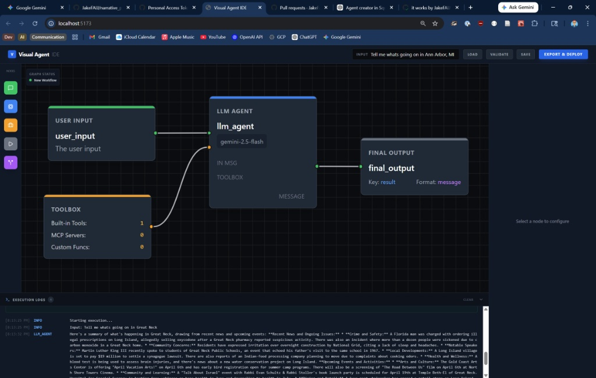

# Visual Agent

Visual Agent is a local-first, node-based IDE for building, validating, and executing generative AI workflows with Google ADK. It focuses on explicit control flow, a shared frontend/backend graph contract, and fast iteration on multi-step agent systems.

Latest release notes: [`v0.1.0`](CHANGELOG.md#v010---2026-04-08)



## What Works Today

- React Flow canvas for composing workflows visually
- Shared JSON contract enforced in both TypeScript and Go
- LLM nodes with text or structured JSON outputs
- Control flow with `if_else_node` and `while_node`
- Toolbox nodes with built-in tools and MCP server wiring
- Saved graphs, in-app example loading, and JSON import
- Run-wide execution budgets plus runtime diagnostics and tracing

## Current Boundaries

- Visual Agent is currently designed as a trusted, local-first tool, not a hosted multi-tenant service.
- The built-in tool catalog is intentionally small today. The default built-in tool is `google_search`.
- MCP server integrations launch local commands, so they should be treated as trusted-user configuration.
- Custom function declarations are a planned feature, but they are not executable in the current runtime yet.

## Examples

The repo includes a small example pack you can open from the UI or inspect directly:

- [`documents/examples/simple-chat.json`](documents/examples/simple-chat.json): minimal input -> LLM -> output workflow
- [`documents/examples/structured-router.json`](documents/examples/structured-router.json): structured classification plus `if_else_node` branching
- [`documents/examples/while-loop-review.json`](documents/examples/while-loop-review.json): looped review/rewrite flow using a real `while_node`
- [`documents/examples/neo-sigma-control-loop.json`](documents/examples/neo-sigma-control-loop.json): larger control-loop example used for experimentation

Open the in-app graph library to load these examples directly, or import the JSON files yourself.

## Architecture

Visual Agent follows a "vibe coding with tight contracts" philosophy:

1. **Front-End:** React + React Flow + Zustand for the canvas and editor state.
2. **Shared Contract:** Zod schemas in TypeScript and matching Go structs define persisted graph shape.
3. **Back-End:** A Go compiler translates graphs into Google ADK agents and runtime orchestration.
4. **Execution:** Graphs execute locally by default, with Vertex AI support when configured.

## Quickstart With Docker

### Prerequisites

- Docker Engine with Docker Compose v2
- For model-backed execution, set `GOOGLE_API_KEY` before starting the stack

### 1. Configure model access

For the Gemini Developer API:

```bash
export GOOGLE_API_KEY=your_api_key
```

### 2. Start the stack

```bash
docker compose up --build
```

Open `http://localhost:3000` in your browser.

Notes:

- The frontend proxies `/api` traffic to the backend container, so you only need one browser URL.
- Saved graphs persist in the named Docker volume `visual-agent-graphs`.
- The backend is not published directly to the host by default.
- Graphs that rely on MCP servers spawning local host commands may need a custom backend image or additional container mounts.

## Native Development

### Prerequisites

- **Node.js:** `^20.19.0` or `>=22.12.0`
- **Go:** `1.25+`
- **Model-backed execution:** either a `GOOGLE_API_KEY` for the Gemini Developer API, or Vertex AI access with [Application Default Credentials (ADC)](https://cloud.google.com/docs/authentication/provide-credentials-adc), `GOOGLE_CLOUD_PROJECT`, and an optional `GOOGLE_CLOUD_LOCATION`

### 1. Start the Back-End API

```bash
cd back_end
go run cmd/visual-agent/main.go serve
```

The API listens on `http://127.0.0.1:8080` by default. Override it with `VISUAL_AGENT_SERVER_ADDR` if needed.

### 2. Start the Front-End IDE

```bash
cd front_end
npm install
npm run dev
```

Open `http://localhost:5173` in your browser. The Vite dev server proxies `/api` requests to `http://127.0.0.1:8080` by default.
Set `VITE_DEV_API_PROXY_TARGET` if your API listens on a different address during development.

### 3. Configure model access

For the Gemini Developer API:

```bash
export GOOGLE_API_KEY=your_api_key
```

For Vertex AI:

```bash
export VISUAL_AGENT_RUNTIME_TYPE=vertex
export GOOGLE_CLOUD_PROJECT=your-project-id
export GOOGLE_CLOUD_LOCATION=us-central1
```

## Development

- Front-end checks: `cd front_end && npm run lint && npm run typecheck && npm run build`
- Back-end checks: `cd back_end && go test ./... && go vet ./... && golangci-lint run ./...`
- Docker quickstart: `docker compose up --build`
- Supporting docs, screenshots, and example workflows live in [`documents/`](documents/README.md)

## License & Community

This project is licensed under the **MIT License**.

---
Copyright © 2026 Jacob D. Bourne
